# YouTube Timeline Memo

유튜브 영상을 시청하면서 특정 시점에 메모를 남기고, 저장된 메모를 클릭해 해당 장면으로 바로 이동할 수 있는 웹 서비스입니다.

> "유튜브 강의 보다가 중요한 부분, 링크 하나로 바로 돌아가기"

## 주요 기능

- **영상 등록** — YouTube URL 입력 또는 키워드 검색으로 영상 추가 (제목, 썸네일, 길이 자동 파싱)
- **타임스탬프 메모** — 영상 재생 중 현재 시각을 자동으로 찍고 메모 저장
- **타임라인 점프** — 저장된 메모 클릭 시 해당 시점으로 즉시 이동
- **메모 수정** — 메모 더블클릭으로 인라인 편집 (Enter 저장 / Esc 취소)
- **메모 검색** — 메모 내용 키워드로 실시간 필터링
- **컬렉션** — 영상을 주제별 폴더로 묶어서 관리
- **공유 링크** — 타임라인이 담긴 페이지를 링크 하나로 공유 (로그인 불필요)
- **다국어 지원** — 한국어 / 영어 언어 전환 (next-intl, URL `/ko/...` `/en/...`)
- **Google 로그인** — Firebase Auth를 통한 Google OAuth 인증
- **게스트 모드** — 로그인 없이 익명으로 서비스 체험, 이후 Google 계정으로 업그레이드 시 데이터 유지
- **관리자 페이지** — 전체 사용자·영상·컬렉션 통계 및 사용자별 상세 현황 (관리자 계정 전용)

## 기술 스택

| 영역 | 기술 |
|------|------|
| Framework | Next.js 16.2 (App Router) + TypeScript |
| Auth | Firebase Auth (Google OAuth + Anonymous) |
| Database | Firestore (Firebase) |
| Styling | Tailwind CSS v4 + shadcn/ui (Base UI) |
| i18n | next-intl v4.9 (ko / en) |
| 배포 | Vercel |
| 외부 API | YouTube Data API v3 |

## 아키텍처

별도 백엔드 서버 없이 **Next.js + Firebase** 단일 스택으로 구성합니다.

```
[ 브라우저 ]
     │
     ▼
[ Next.js (Vercel) ]
├── App Router (Server Components + Client Components)
├── /api/youtube           ← YouTube 영상 정보 파싱 (API Key 서버에서만 사용)
├── /api/youtube/search    ← YouTube 키워드 검색
├── /api/videos            ← 영상 추가 (서버 사이드 Firestore 쓰기)
├── /api/share             ← shareToken 생성/폐기
├── /api/auth/session      ← Firebase Admin SDK 세션 쿠키 발급/삭제
├── /api/auth/migrate      ← 게스트→Google 계정 전환 시 데이터 이관
└── /api/admin/users       ← 관리자 전용 사용자 목록 조회
     │
     ▼
[ Firebase ]              [ YouTube Data API ]
├── Auth (Google OAuth + Anonymous)
└── Firestore
```

**인증 방식:** Firebase Admin SDK 세션 쿠키 (`__session`, httpOnly)
- Google 로그인 → `getIdToken` → `POST /api/auth/session` → 서버 컴포넌트에서 쿠키 검증
- 게스트 로그인 → `signInAnonymously` → 동일 흐름으로 세션 쿠키 발급 (Firestore 보안 규칙 그대로 적용)
- 게스트 → Google 계정 업그레이드: `linkWithPopup`으로 UID 유지, 이미 존재하는 계정이면 `/api/auth/migrate`로 데이터 이관

## 페이지 구성

URL은 `/[locale]/...` 형식입니다 (예: `/ko/dashboard`, `/en/login`).

| 경로 | 설명 |
|------|------|
| `/` | 랜딩 페이지 |
| `/login` | Google 로그인 / 게스트로 시작하기 |
| `/dashboard` | 내 영상 (최대 4개) + 컬렉션 (최대 4개) 요약 |
| `/videos` | 영상 목록 전체 (제목 검색 필터) |
| `/videos/:id` | 영상 뷰어 + 타임라인 메모 (핵심 페이지) |
| `/videos/:id/edit` | 메모 전체 목록 수정/삭제 |
| `/collections` | 컬렉션 관리 |
| `/share/:token` | 공유 읽기 전용 (로그인 불필요) |
| `/admin` | 관리자 대시보드 (통계 + 사용자별 현황) |

## 로컬 실행

### 1. 의존성 설치

```bash
yarn install
```

### 2. 환경 변수 설정

`.env.example`을 복사해 `.env.local`을 생성하고 값을 입력합니다.

```bash
cp .env.example .env.local
```

```env
# Firebase 클라이언트 SDK
NEXT_PUBLIC_FIREBASE_API_KEY=
NEXT_PUBLIC_FIREBASE_AUTH_DOMAIN=
NEXT_PUBLIC_FIREBASE_PROJECT_ID=
NEXT_PUBLIC_FIREBASE_STORAGE_BUCKET=
NEXT_PUBLIC_FIREBASE_MESSAGING_SENDER_ID=
NEXT_PUBLIC_FIREBASE_APP_ID=

# Firebase Admin SDK (서비스 계정 JSON을 한 줄로 직렬화)
FIREBASE_ADMIN_SDK=

# YouTube Data API v3 (서버에서만 사용)
YOUTUBE_API_KEY=

# 서비스 배포 URL (SEO, sitemap, OG 태그에 사용)
NEXT_PUBLIC_BASE_URL=https://your-domain.vercel.app

# Google AdSense (선택 - 승인 후 입력)
NEXT_PUBLIC_ADSENSE_CLIENT=
NEXT_PUBLIC_ADSENSE_SLOT_DASHBOARD=
NEXT_PUBLIC_ADSENSE_SLOT_COLLECTIONS=
NEXT_PUBLIC_ADSENSE_SLOT_SHARE=
```

### 3. Firestore 보안 규칙 배포

Firebase 콘솔 또는 CLI에서 `firestore.rules`를 배포합니다.

### 4. 개발 서버 실행

```bash
yarn dev
```

브라우저에서 [http://localhost:3000](http://localhost:3000)을 열면 됩니다.

## 프로젝트 구조

```
src/
├── app/
│   ├── [locale]/                  ← 로케일 prefix (ko / en)
│   │   ├── layout.tsx             ← NextIntlClientProvider
│   │   ├── page.tsx               ← 랜딩 페이지 (JSON-LD 포함)
│   │   ├── not-found.tsx
│   │   ├── login/
│   │   ├── share/[token]/         ← 공유 읽기 전용 (OG 태그 포함)
│   │   └── (protected)/           ← 인증 필요 페이지 (세션 검증, noindex)
│   │       ├── dashboard/
│   │       │   └── loading.tsx
│   │       ├── videos/
│   │       │   ├── loading.tsx
│   │       │   ├── [id]/
│   │       │   └── [id]/edit/
│   │       ├── collections/
│   │       │   └── loading.tsx
│   │       └── admin/             ← 관리자 전용 (통계 + 사용자 목록)
│   ├── api/
│   │   ├── auth/session/          ← 세션 쿠키 발급/삭제
│   │   ├── auth/migrate/          ← 게스트→Google 계정 데이터 이관
│   │   ├── youtube/               ← YouTube 영상 정보 파싱
│   │   ├── youtube/search/        ← YouTube 키워드 검색
│   │   ├── videos/                ← 영상 추가 (서버 사이드)
│   │   ├── share/                 ← shareToken 생성/폐기
│   │   └── admin/users/           ← 관리자 사용자 목록
│   ├── opengraph-image.tsx        ← OG 이미지 자동 생성 (1200×630)
│   ├── sitemap.ts                 ← sitemap.xml 자동 생성
│   └── robots.ts                  ← robots.txt 자동 생성
├── components/
│   ├── admin/                     ← UserDetailRow
│   ├── ads/                       ← AdBanner (Google AdSense)
│   ├── collections/               ← CollectionCard, AddCollectionDialog 등
│   ├── dashboard/                 ← DashboardContent
│   ├── landing/                   ← 랜딩 페이지 섹션 컴포넌트
│   ├── player/                    ← VideoViewerClient, MemoList, MemoEditContent
│   │                                 ShareViewerClient, ShareDialog
│   ├── ui/                        ← shadcn/ui 공통 컴포넌트
│   ├── videos/                    ← VideoCard, AddVideoDialog, VideosContent
│   ├── Header.tsx
│   ├── LocaleSwitcher.tsx         ← 언어 전환 (ko/en)
│   ├── UserMenu.tsx
│   └── KakaoInAppBrowserGuard.tsx ← 카카오 인앱 브라우저 안내
├── i18n/
│   ├── routing.ts                 ← locales: ['ko','en'], defaultLocale: 'ko'
│   ├── request.ts
│   └── navigation.ts
├── messages/
│   ├── ko.json
│   └── en.json
├── proxy.ts                       ← next-intl 미들웨어 (Next.js 16.2 규칙)
├── lib/
│   ├── firebase/
│   │   ├── config.ts              ← Firebase app + Firestore 초기화 (SSR 안전)
│   │   ├── auth.ts                ← Google·게스트 로그인/로그아웃, 계정 업그레이드 (클라이언트 전용)
│   │   ├── firestore.ts           ← 클라이언트 CRUD 헬퍼
│   │   ├── admin.ts               ← Firebase Admin SDK + 세션 검증
│   │   ├── admin-firestore.ts     ← 서버 전용 Firestore 쿼리
│   │   └── admin-stats.ts         ← 관리자 통계 쿼리
│   └── youtube/
│       └── index.ts               ← extractYouTubeId, formatTimestamp, parseDuration
└── types/index.ts                 ← Video, Memo, Collection, User 타입 정의
```

## DB 스키마 (Firestore)

```
users/{uid}
  - email, displayName, createdAt

videos/{videoId}
  - youtubeId, title, thumbnail, durationSec
  - userId, shareToken (null = 비공개), createdAt

videos/{videoId}/memos/{memoId}
  - timestampSec, content, createdAt

collections/{colId}
  - name, description, videoIds[], userId, createdAt
```

## SEO

| 항목 | 내용 |
|------|------|
| 메타데이터 | title template, description, keywords, OG/Twitter 카드 |
| sitemap.xml | `/`, `/login` 자동 생성 |
| robots.txt | 보호 페이지(`/dashboard`, `/videos`, `/collections`, `/api/`) 크롤 차단 |
| OG 이미지 | `/opengraph-image` — SNS 링크 공유 시 미리보기 이미지 자동 생성 |
| JSON-LD | 랜딩 페이지 `SoftwareApplication` 구조화 데이터 |
| noindex | 로그인 필요 페이지 전체 검색엔진 색인 제외 |

배포 후 [Google Search Console](https://search.google.com/search-console)에 `sitemap.xml`을 등록하세요.

## 빌드

```bash
yarn build
yarn start
```

## 구현 화면

### 랜딩 페이지 (`/`)
서비스 소개와 주요 기능 카드, 시작하기 버튼으로 구성된 메인 진입 화면입니다.

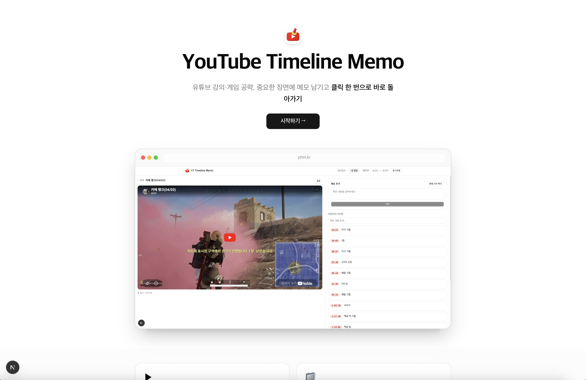
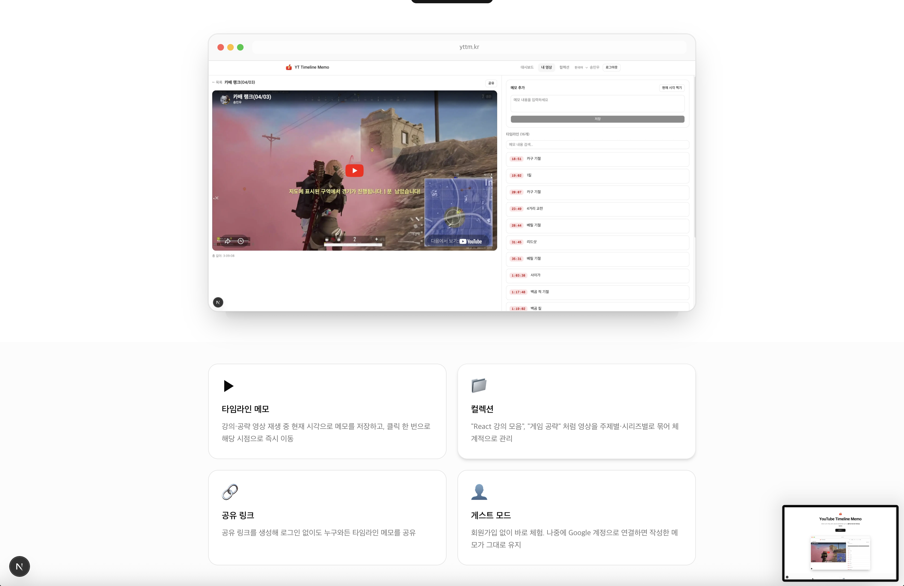

### 로그인 (`/login`)
Google 계정으로 로그인하거나, 로그인 없이 게스트로 바로 서비스를 체험할 수 있습니다. 게스트로 시작한 경우 상단 헤더에 "게스트" 배지가 표시되며, "Google로 계정 연결" 버튼으로 언제든지 계정을 업그레이드할 수 있습니다. 업그레이드 시 기존에 작성한 영상·메모·컬렉션 데이터가 그대로 유지됩니다.

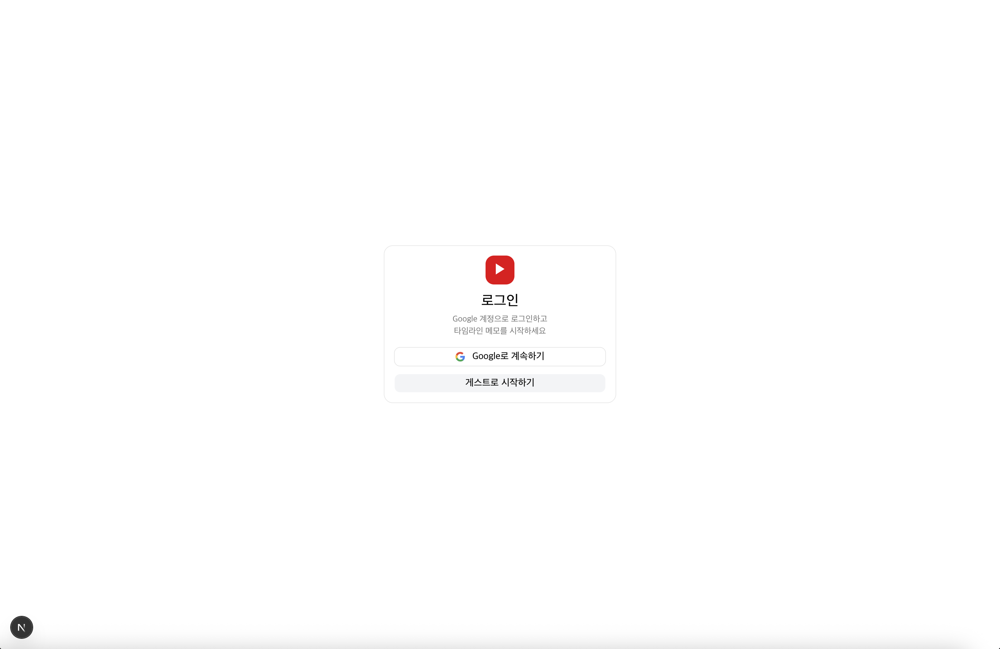

### 대시보드 (`/dashboard`)
로그인 후 첫 화면입니다. 최근 영상(최대 4개)과 컬렉션(최대 4개)을 한눈에 확인하고, 각 섹션에서 모두 보기로 전체 목록 페이지로 이동할 수 있습니다.

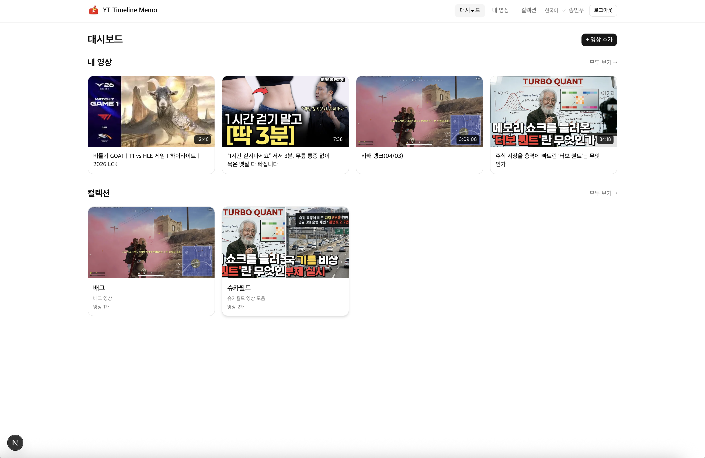

### 영상 목록 (`/videos`)
등록한 전체 영상을 카드 형태로 확인합니다. 제목 검색 필터로 원하는 영상을 빠르게 찾을 수 있습니다.

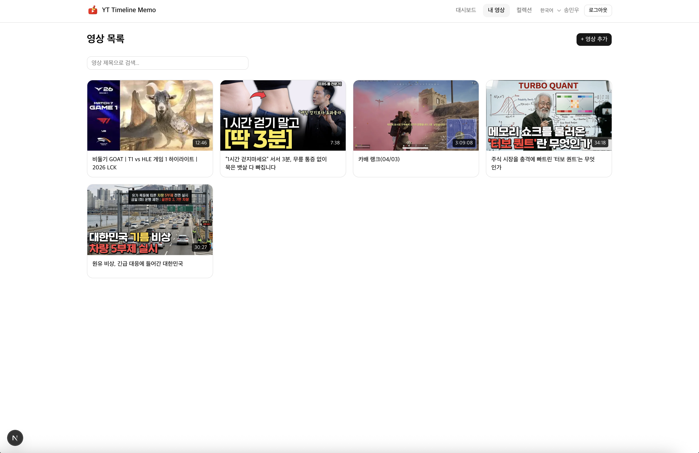

### 영상 추가
YouTube URL을 직접 입력하거나 키워드 검색으로 영상을 추가합니다. 제목·썸네일·재생 시간이 자동으로 파싱됩니다.

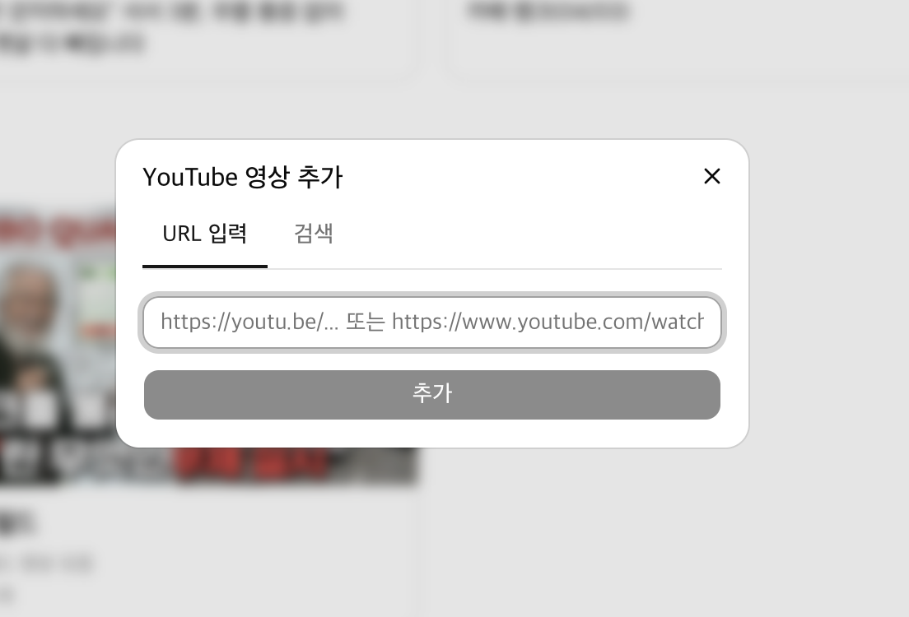
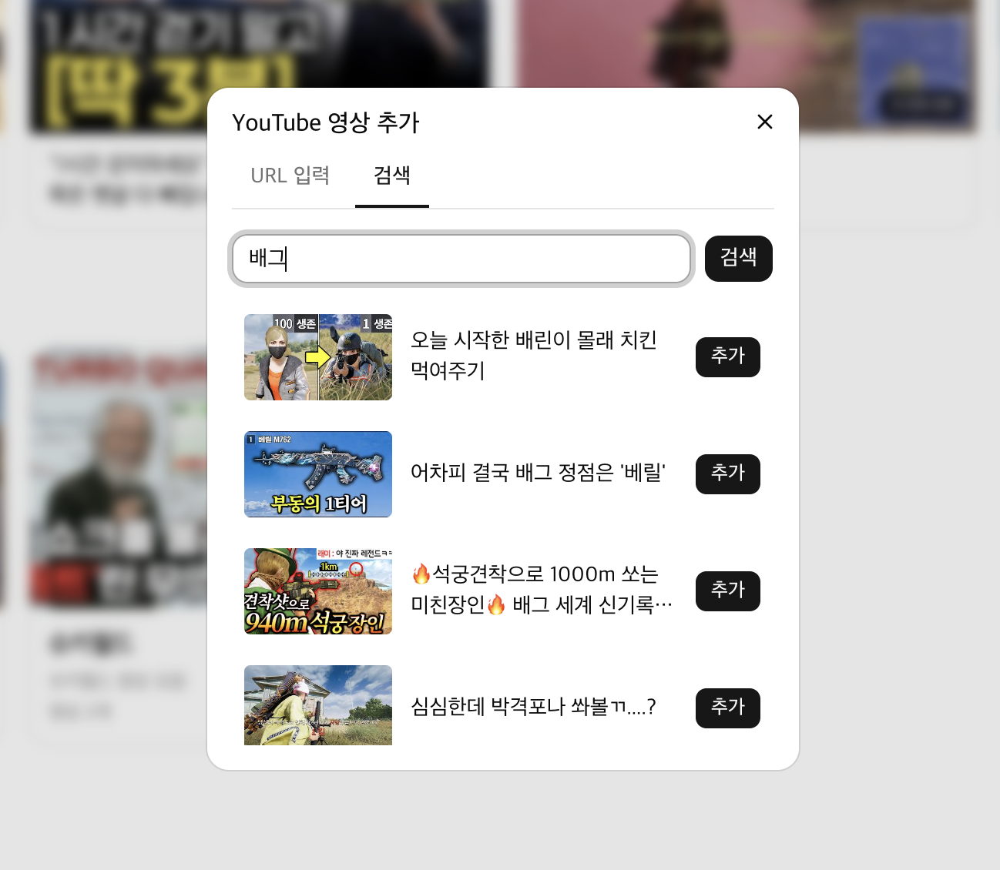

### 영상 뷰어 (`/videos/:id`)
서비스의 핵심 페이지입니다. 좌측 YouTube 플레이어와 우측 타임라인 메모 목록이 좌우 분할 구조로 배치됩니다. 메모 클릭 시 해당 시점으로 즉시 이동하며, 메모 더블클릭으로 인라인 수정이 가능합니다.

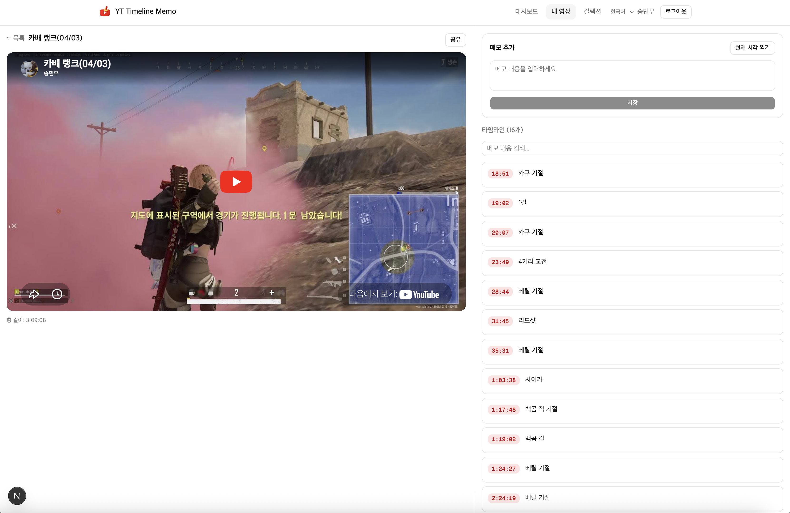

### 컬렉션 (`/collections`)
영상을 주제별 폴더로 묶어서 관리합니다. 컬렉션 카드를 클릭하면 포함된 영상 목록과 추가 가능한 영상을 관리할 수 있는 다이얼로그가 열립니다.

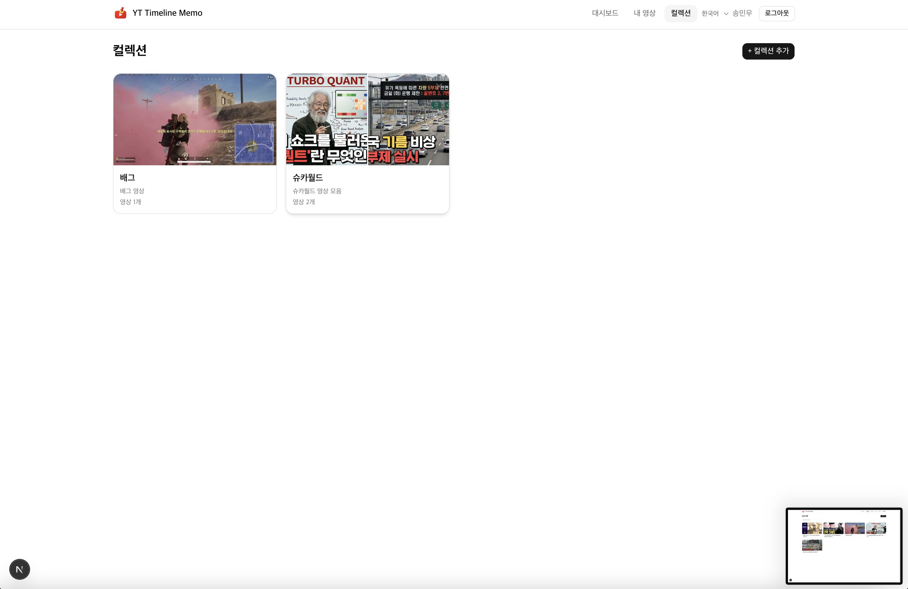
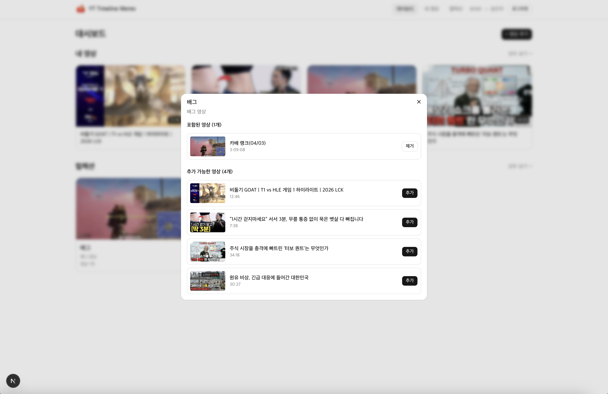

### 공유 링크
영상 뷰어에서 공유 버튼을 누르면 타임라인 메모가 담긴 공유 URL을 생성하고 복사할 수 있습니다. 링크를 받은 누구나 로그인 없이 타임라인 메모를 열람할 수 있습니다.

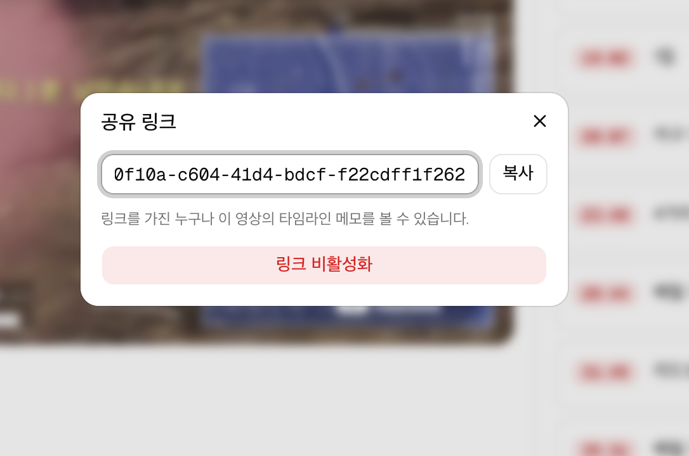

### 관리자 페이지 (`/admin`)
관리자 계정 전용 페이지입니다. 전체 사용자·영상·컬렉션 통계를 확인하고, 사용자별 등록 영상과 컬렉션 상세 현황을 펼쳐볼 수 있습니다.

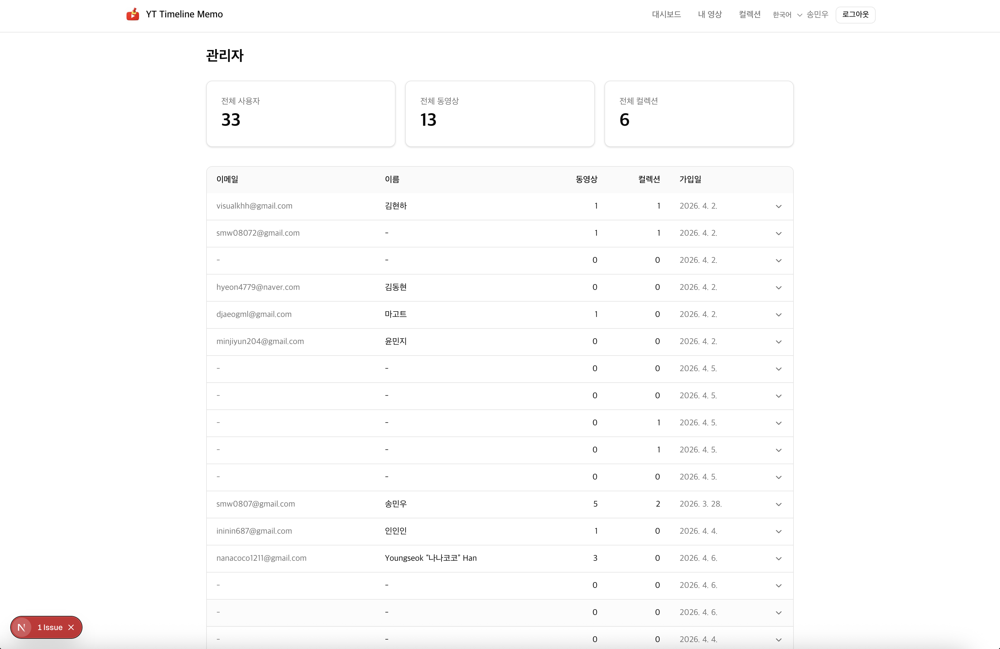
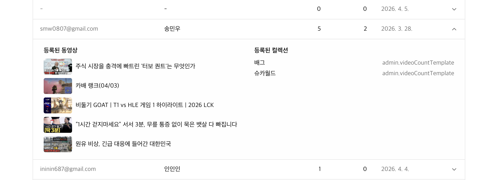
