# YouTube Timeline Memo

유튜브 영상을 시청하면서 특정 시점에 메모를 남기고, 저장된 메모를 클릭해 해당 장면으로 바로 이동할 수 있는 웹 서비스입니다.

> "유튜브 강의 보다가 중요한 부분, 링크 하나로 바로 돌아가기"

## 주요 기능

- **영상 등록** — YouTube URL 입력 또는 키워드 검색으로 영상 추가 (제목, 썸네일, 길이 자동 파싱)
- **타임스탬프 메모** — 영상 재생 중 현재 시각을 자동으로 찍고 메모 저장
- **타임라인 점프** — 저장된 메모 클릭 시 해당 시점으로 즉시 이동
- **메모 수정** — 메모 더블클릭으로 인라인 편집 (Enter 저장 / Esc 취소)
- **메모 검색** — 메모 내용 키워드로 실시간 필터링
- **컬렉션** — 영상을 주제별 폴더로 묶어서 관리
- **공유 링크** — 타임라인이 담긴 페이지를 링크 하나로 공유 (로그인 불필요)
- **다국어 지원** — 한국어 / 영어 언어 전환 (next-intl, URL `/ko/...` `/en/...`)
- **Google 로그인** — Firebase Auth를 통한 Google OAuth 인증
- **게스트 모드** — 로그인 없이 익명으로 서비스 체험, 이후 Google 계정으로 업그레이드 시 데이터 유지
- **관리자 페이지** — 전체 사용자·영상·컬렉션 통계 및 사용자별 상세 현황 (관리자 계정 전용)

## 기술 스택

| 영역      | 기술                                     |
| --------- | ---------------------------------------- |
| Framework | Next.js 16.2 (App Router) + TypeScript   |
| Auth      | Firebase Auth (Google OAuth + Anonymous) |
| Database  | Firestore (Firebase)                     |
| Styling   | Tailwind CSS v4 + shadcn/ui (Base UI)    |
| i18n      | next-intl v4.9 (ko / en)                 |
| 배포      | Vercel                                   |
| 외부 API  | YouTube Data API v3                      |

## 아키텍처

별도 백엔드 서버 없이 **Next.js + Firebase** 단일 스택으로 구성합니다.

```
[ 브라우저 ]
     │
     ▼
[ Next.js (Vercel) ]
├── App Router (Server Components + Client Components)
├── /api/youtube           ← 인증 사용자 영상 정보 파싱 (사용자별 rate limit + 6시간 캐시)
├── /api/youtube/search    ← 인증 사용자 키워드 검색 (사용자별 rate limit + 5분 캐시)
├── /api/videos            ← 영상 추가 (서버 사이드 Firestore 쓰기)
├── /api/share             ← shareToken 생성/폐기
├── /api/auth/session      ← Firebase Admin SDK 세션 쿠키 발급/삭제
├── /api/auth/migrate      ← 게스트→Google 계정 전환 시 데이터 이관
└── /api/admin/users       ← 관리자 전용 사용자 목록 조회
     │
     ▼
[ Firebase ]              [ YouTube Data API ]
├── Auth (Google OAuth + Anonymous)
└── Firestore
```

**인증 방식:** Firebase Admin SDK 세션 쿠키 (`__session`, httpOnly)

- Google 로그인 → `getIdToken` → `POST /api/auth/session` → 서버 컴포넌트에서 쿠키 검증
- 게스트 로그인 → `signInAnonymously` → 동일 흐름으로 세션 쿠키 발급 (Firestore 보안 규칙 그대로 적용)
- 게스트 → Google 계정 업그레이드: `linkWithPopup`으로 UID 유지, 이미 존재하는 계정이면 `/api/auth/migrate`로 데이터 이관

## 페이지 구성

URL은 `/[locale]/...` 형식입니다 (예: `/ko/dashboard`, `/en/login`).

| 경로               | 설명                                        |
| ------------------ | ------------------------------------------- |
| `/`                | 랜딩 페이지                                 |
| `/login`           | Google 로그인 / 게스트로 시작하기           |
| `/dashboard`       | 내 영상 (최대 4개) + 컬렉션 (최대 4개) 요약 |
| `/videos`          | 영상 목록 전체 (제목 검색 필터)             |
| `/videos/:id`      | 영상 뷰어 + 타임라인 메모 (핵심 페이지)     |
| `/videos/:id/edit` | 메모 전체 목록 수정/삭제                    |
| `/collections`     | 컬렉션 관리                                 |
| `/share/:token`    | 공유 읽기 전용 (로그인 불필요)              |
| `/admin`           | 관리자 대시보드 (통계 + 사용자별 현황)      |

## 로컬 실행

### 1. 의존성 설치

```bash
yarn install
```

### 2. 환경 변수 설정

`.env.example`을 복사해 `.env.local`을 생성하고 값을 입력합니다.

```bash
cp .env.example .env.local
```

```env
# Firebase 클라이언트 SDK
NEXT_PUBLIC_FIREBASE_API_KEY=
NEXT_PUBLIC_FIREBASE_AUTH_DOMAIN=
NEXT_PUBLIC_FIREBASE_PROJECT_ID=
NEXT_PUBLIC_FIREBASE_STORAGE_BUCKET=
NEXT_PUBLIC_FIREBASE_MESSAGING_SENDER_ID=
NEXT_PUBLIC_FIREBASE_APP_ID=

# Firebase Admin SDK (서비스 계정 JSON 전체를 Base64로 인코딩한 한 줄 값)
FIREBASE_ADMIN_SDK=

# 관리자 Firebase UID 1개 (이메일 아님, 미설정 시 관리자 접근 거부)
ADMIN_UID=

# YouTube Data API v3 (서버에서만 사용)
YOUTUBE_API_KEY=

# 서비스 배포 URL (SEO, sitemap, OG 태그에 사용)
NEXT_PUBLIC_BASE_URL=https://your-domain.vercel.app

# Naver Site Verification
NEXT_PUBLIC_NAVER_SITE_VERIFICATION=

# Kakao AdFit (선택 - 비워두면 광고 배너 미표시)
NEXT_PUBLIC_ADFIT_UNIT=
```

`FIREBASE_ADMIN_SDK`와 `YOUTUBE_API_KEY`는 서버 전용 비밀값입니다. Base64는 암호화가 아니므로 서비스 계정 JSON과 `.env.local`을 커밋하거나 채팅·로그에 출력하지 마세요. Vercel에서는 두 키를 Secret으로 관리하고, 공개 클라이언트 설정은 Config로 유지합니다. `ADMIN_UIDS`와 위에 없는 이전 AdSense 변수는 현재 웹 소스에서 사용하지 않습니다.

운영 환경변수 점검 결과와 승인 후 적용할 항목은 [운영 검증 기록](docs/production-validation.md#환경변수-정리-점검--2026-09-13)을 참고하세요. 환경변수 변경과 웹 배포는 별도 단계입니다.

### 3. Firestore 보안 규칙 배포

Firebase 콘솔 또는 CLI에서 `firestore.rules`를 배포합니다.

### 4. 개발 서버 실행

```bash
yarn dev
```

브라우저에서 [http://localhost:3000](http://localhost:3000)을 열면 됩니다.

## 프로젝트 구조

```
src/
├── app/
│   ├── [locale]/                  ← 로케일 prefix (ko / en)
│   │   ├── layout.tsx             ← NextIntlClientProvider
│   │   ├── page.tsx               ← 랜딩 페이지 (JSON-LD 포함)
│   │   ├── not-found.tsx
│   │   ├── login/
│   │   ├── share/[token]/         ← 공유 읽기 전용 (OG 태그 포함)
│   │   └── (protected)/           ← 인증 필요 페이지 (세션 검증, noindex)
│   │       ├── dashboard/
│   │       │   └── loading.tsx
│   │       ├── videos/
│   │       │   ├── loading.tsx
│   │       │   ├── [id]/
│   │       │   └── [id]/edit/
│   │       ├── collections/
│   │       │   └── loading.tsx
│   │       └── admin/             ← 관리자 전용 (통계 + 사용자 목록)
│   ├── api/
│   │   ├── auth/session/          ← 세션 쿠키 발급/삭제
│   │   ├── auth/migrate/          ← 게스트→Google 계정 데이터 이관
│   │   ├── youtube/               ← YouTube 영상 정보 파싱
│   │   ├── youtube/search/        ← YouTube 키워드 검색
│   │   ├── videos/                ← 영상 추가 (서버 사이드)
│   │   ├── share/                 ← shareToken 생성/폐기
│   │   └── admin/users/           ← 관리자 사용자 목록
│   ├── opengraph-image.tsx        ← OG 이미지 자동 생성 (1200×630)
│   ├── sitemap.ts                 ← sitemap.xml 자동 생성
│   └── robots.ts                  ← robots.txt 자동 생성
├── components/
│   ├── admin/                     ← UserDetailRow
│   ├── ads/                       ← AdBanner (Kakao AdFit)
│   ├── collections/               ← CollectionCard, AddCollectionDialog 등
│   ├── dashboard/                 ← DashboardContent
│   ├── landing/                   ← 랜딩 페이지 섹션 컴포넌트
│   ├── player/                    ← VideoViewerClient, MemoList, MemoEditContent
│   │                                 ShareViewerClient, ShareDialog
│   ├── ui/                        ← shadcn/ui 공통 컴포넌트
│   ├── videos/                    ← VideoCard, AddVideoDialog, VideosContent
│   ├── Header.tsx
│   ├── LocaleSwitcher.tsx         ← 언어 전환 (ko/en)
│   ├── UserMenu.tsx
│   └── KakaoInAppBrowserGuard.tsx ← 카카오 인앱 브라우저 안내
├── i18n/
│   ├── routing.ts                 ← locales: ['ko','en'], defaultLocale: 'ko'
│   ├── request.ts
│   └── navigation.ts
├── messages/
│   ├── ko.json
│   └── en.json
├── proxy.ts                       ← next-intl 미들웨어 (Next.js 16.2 규칙)
├── lib/
│   ├── firebase/
│   │   ├── config.ts              ← Firebase app + Firestore 초기화 (SSR 안전)
│   │   ├── auth.ts                ← Google·게스트 로그인/로그아웃, 계정 업그레이드 (클라이언트 전용)
│   │   ├── firestore.ts           ← 클라이언트 CRUD 헬퍼
│   │   ├── admin.ts               ← Firebase Admin SDK + 세션 검증
│   │   ├── admin-firestore.ts     ← 서버 전용 Firestore 쿼리
│   │   └── admin-stats.ts         ← 관리자 통계 쿼리
│   └── youtube/
│       └── index.ts               ← extractYouTubeId, formatTimestamp, parseDuration
└── types/index.ts                 ← Video, Memo, Collection, User 타입 정의
```

### 웹·확장프로그램 공통 모듈

저장소 루트의 `shared/`를 두 앱이 소스로 직접 참조합니다. 별도 패키지 설치나 빌드 단계는 없습니다.

- `shared/types/index.ts`: 영상 메타데이터, `Video<TCreatedAt>`, `Memo<TCreatedAt>`, `WithId<T>`.
- `shared/utils/youtube.ts`: YouTube ID 추출·검증, 썸네일 선택, 재생시간 파싱·표시.
- 기존 `src/types`, `src/lib/youtube`, `extension/src/types`, `extension/src/lib/youtube` import 경로는 유지합니다.

공통 모듈은 Firebase·React·Next.js·Chrome API에 의존하지 않습니다. ESLint가 플랫폼 패키지 import와 주요 플랫폼 전역 접근을 제한합니다.
웹은 `Timestamp | number`, 확장프로그램은 실시간 쓰기 대기 상태를 포함한 `Timestamp | number | null`을 각자 주입합니다.
서로 형태가 다른 사용자 타입, 웹 전용 컬렉션, Firebase CRUD·인증, 확장프로그램 DOM 접근·메시지 프로토콜은 각 앱에 둡니다.
Firebase SDK 버전은 웹과 확장프로그램에서 각각 유지하므로 공통 코드에 SDK를 직접 import하지 마세요.

확장프로그램만 개발하더라도 `extension/`과 `shared/`의 상대 위치를 유지해야 합니다.
공통 코드 변경 시 아래 품질 검사와 **두 앱의 빌드**를 모두 실행합니다. `tests/unit/shared-contracts.test.ts`는 기존 진입점 연결과 타입 호환성을,
`tests/unit/extension-youtube.test.ts`는 확장프로그램 DOM 어댑터의 동작을 확인합니다.

### 웹 온보딩과 선택적 사용성 지표

- 대시보드와 영상 뷰어에서 **영상 추가 → 메모 저장 → 메모 시간으로 장면 이동**을 안내합니다. 한국어·영어를 지원하며 안내 닫기/다시 보기가 가능합니다.
- 진행 상태와 브라우저별 수집 동의는 `yttm:onboarding:v1:{uid}` 로컬 저장소에 보관합니다. 저장소 접근이 막혀도 현재 페이지에서는 메모리로 작동합니다. 계정 전환 시 상태를 분리하며, 게스트 계정의 UID가 바뀌는 업그레이드에서는 안내·동의를 새로 시작합니다.
- 지표는 **기본 비활성화**입니다. 대시보드 하단에서 명시적으로 동의한 뒤 성공한 작업에 대해서만 `/api/onboarding`으로 전송합니다. 외부 분석 SDK나 분석용 쿠키는 추가하지 않습니다. 안내 기능은 동의 없이도 사용할 수 있습니다.
- 이벤트는 `video_added`, `memo_created`, `timeline_used` 세 가지뿐입니다. 서버는 세션 UID, 동일 출처, 클라이언트의 현재 계정, 영상·메모 소유권을 검사합니다. 1분당 계정별 30회 제한이 적용됩니다. 메모 시간 이동은 플레이어가 준비된 상태의 클릭을 의미하며, 실제 재생 완료까지 검증하는 지표는 아닙니다.
- `_onboardingMetrics/{sha256("onboarding-v1:" + uid)}`에는 동의 상태, 기능 도달 여부와 집계용 `step`만 기록합니다. 원문 UID·이메일·메모 내용·영상 제목·영상/메모 ID는 지표 문서에 저장하지 않습니다. 해시 식별자는 익명 데이터가 아닌 계정별 가명 식별자입니다. 영상·메모 ID는 소유권 검증을 위한 요청에만 사용됩니다.
- Firestore 트랜잭션이 중복 및 순서가 바뀐 이벤트를 처리합니다. 단계는 앞선 기능에도 모두 도달해야 올라갑니다. 예를 들어 영상 추가 없이 기존 영상에서 메모만 저장했다면 첫 단계 수에는 포함하지 않습니다.
- ‘수집 중단 및 계정 지표 삭제’는 단계 기록을 제거하고 늦게 도착하는 이벤트를 막는 비동의 상태만 남깁니다. 다른 브라우저의 로컬 표시가 이전 동의 상태여도 서버는 이벤트를 거부합니다. 다시 동의하면 새 집계를 시작합니다. 삭제 실패 시 브라우저 전송은 즉시 중단하고 UI에서 재시도를 안내합니다.
- 관리자 페이지는 현재 동의한 계정의 누적 단계별 인원과 동의 계정 대비 비율을 표시합니다. 동의 전 활동·확장프로그램 활동은 소급 집계하지 않으며, 신규 가입자 코호트나 일간 활성 사용자 지표가 아닙니다. 동의를 철회한 계정은 모든 단계의 집계에서 제외됩니다.
- 지표 전송 실패는 영상·메모 저장을 실패시키지 않습니다. 전송은 최선 노력 방식이며 네트워크 오류·페이지 종료로 일부 이벤트가 누락될 수 있습니다. 수집 거부 상태를 포함한 모든 지표 문서는 기존 Firestore 기본 거부 규칙으로 클라이언트의 직접 읽기·쓰기가 차단됩니다.

새 환경변수나 외부 서비스 등록은 필요 없습니다. 배포 후 게스트 계정으로 동의/미동의 각각의 3단계 흐름과 관리자 집계, 동의 철회 시 집계 제외를 확인하세요. 운영 인증·YouTube 재생과 모바일 화면의 실제 브라우저 검증은 자동 테스트와 별도로 수행합니다.

## DB 스키마 (Firestore)

```
users/{uid}
  - email, displayName, createdAt

videos/{videoId}
  - youtubeId, title, thumbnail, durationSec
  - userId, shareToken (null = 비공개), createdAt

videos/{videoId}/memos/{memoId}
  - timestampSec, content, createdAt

collections/{colId}
  - name, description, videoIds[], userId, createdAt

_rateLimits/{hashedScopeAndUid}   # 서버 전용
  - count, resetAt

_onboardingMetrics/{hashedUid}   # 서버 전용, 선택 동의한 웹 사용성 지표
  - enabled, video_added, memo_created, timeline_used, step (0~3)
  # 수집 철회 후에는 enabled: false만 유지
```

## SEO

| 항목        | 내용                                                                    |
| ----------- | ----------------------------------------------------------------------- |
| 메타데이터  | title template, description, keywords, OG/Twitter 카드                  |
| sitemap.xml | `/`, `/login` 자동 생성                                                 |
| robots.txt  | 보호 페이지(`/dashboard`, `/videos`, `/collections`, `/api/`) 크롤 차단 |
| OG 이미지   | `/opengraph-image` — SNS 링크 공유 시 미리보기 이미지 자동 생성         |
| JSON-LD     | 랜딩 페이지 `SoftwareApplication` 구조화 데이터                         |
| noindex     | 로그인 필요 페이지 전체 검색엔진 색인 제외                              |

배포 후 [Google Search Console](https://search.google.com/search-console)에 `sitemap.xml`을 등록하세요.

## 빌드

### 품질 검사와 CI

Node.js 22와 Yarn 1.22.22를 기준으로 웹과 확장프로그램을 함께 검사합니다.

```bash
yarn install --frozen-lockfile
yarn --cwd extension install --frozen-lockfile
yarn lint
yarn format:check
yarn typecheck
yarn build:ci
yarn --cwd extension build
```

GitHub Actions는 모든 PR과 `main` / `master` / `develop` 푸시에 위 검사를 실행합니다. 린트 경고도 실패로 처리하며 생성물과 환경변수 파일은 포맷 대상에서 제외합니다. `yarn format`으로 웹(Tailwind v4)과 확장프로그램(Tailwind v3)을 각 설정에 맞춰 정렬할 수 있습니다.

`build:ci`는 실행 시 생성한 임시 Firebase 자격증명으로 빌드하므로 GitHub Secrets가 필요하지 않습니다. 이 빌드 결과는 배포용이 아니며, 실제 Firebase 인증·조회 동작을 테스트하지 않습니다. Google Fonts 다운로드에는 네트워크 연결이 필요합니다. 배포용 빌드는 실제 환경변수를 설정한 후 아래 명령을 사용하세요.

```bash
yarn build
yarn start
```

## 자동 테스트

Node.js 22.12 이상(22.x / 24.x)과 Yarn 1.22.22를 사용합니다. Firestore 테스트에는 Java 21이 필요합니다.

```bash
yarn test          # 핵심 유틸리티, API 인증/권한, 공유 페이지 단위 테스트
yarn test:watch    # 단위 테스트 감시 모드
yarn test:emulator # 에뮬레이터 시작 → Rules/트랜잭션 테스트 → 종료
yarn test:all      # 두 종류 모두 실행
```

- 단위 테스트: 게스트 이관 권한과 위조 UID 차단, 비인증·교차 출처·제한 초과 응답, 검색·영상 정보 변환, 공개 공유 데이터 최소화를 검증합니다.
- 에뮬레이터 테스트: 소유자와 타인·비로그인 사용자별 CRUD, 소유권 변경 차단, 공유 문서 직접 접근 차단, 서버 전용 카운터 보호, 동시 호출 제한과 시간창 초기화를 검증합니다.
- 로컬 `127.0.0.1:8085`와 가상 프로젝트 `demo-yttm-tests`만 사용하며 Firebase 로그인이나 운영 키가 필요하지 않습니다. 첫 실행에는 에뮬레이터 다운로드가 필요합니다.
- CI에서도 두 테스트를 실행합니다. 외부 로그인·YouTube 호출은 단위 테스트에서 대체하므로 실제 OAuth 동작과 배포 환경의 캐시 적중 여부는 별도 검증 대상입니다.

[Firebase Rules 테스트 문서](https://firebase.google.com/docs/rules/unit-tests)를 바탕으로 실제 에뮬레이터에서 접근 허용·거부를 검증합니다.

### 실제 브라우저 회귀 테스트

```bash
yarn test:e2e       # Chrome에서 PC(한국어)·모바일 크기(영어) 회귀 검증
yarn test:e2e:webkit # WebKit에서 PC·iPhone 크기 회귀 검증 (수동 실행)
yarn test:e2e:live  # 외부 YouTube iframe의 실제 재생·메모 위치 이동 검증 (수동 실행)
yarn dev:emulator  # 수동 점검용 격리 서버: http://localhost:3100/ko/login
```

- Node.js·Java 요구 사항은 위 에뮬레이터 테스트와 같습니다. macOS에서는 설치된 Google Chrome을 사용합니다. CI/Linux는 `yarn playwright install --with-deps chromium`으로 브라우저를 설치합니다. `E2E_BROWSER_CHANNEL=chromium`으로 Playwright의 Chromium을 선택할 수도 있습니다.
- WebKit은 최초 실행 전에 `yarn playwright install webkit`으로 설치합니다(Linux는 `--with-deps` 추가). `test:e2e:webkit`은 설치된 Playwright 버전의 WebKit과 iPhone 13 에뮬레이션을 사용하며 `E2E_BROWSER_CHANNEL`을 적용하지 않습니다. 실제 Safari 앱·iPhone·OS 클립보드 검증을 대체하지 않으며 기본 CI에는 추가하지 않았습니다.
- 공유 링크 복사 테스트는 Clipboard API의 거부·미지원·성공 응답을 대체해 오류 안내, 링크 직접 선택, 재시도를 확인합니다. 사용자의 실제 클립보드 내용은 읽거나 덮어쓰지 않습니다.
- 인증 `127.0.0.1:9098`, Firestore `127.0.0.1:8086`, 웹 `localhost:3100`과 고정 가상 프로젝트 `demo-yttm-e2e`만 사용합니다. 포트가 사용 중이면 기존 서버를 재사용하지 않고 중단합니다. 웹 포트만 충돌하면 `E2E_PORT=3101 yarn test:e2e`로 변경할 수 있으며, 인증·DB의 격리는 그대로 유지됩니다. 테스트 시작 시 이 가상 프로젝트의 에뮬레이터 데이터만 초기화합니다.
- 임시 자격증명과 비어 있는 YouTube/광고 키를 자식 프로세스에 주입합니다. `.env.local`의 운영 Firebase 설정을 사용하지 않으며, 브라우저는 새 프로필로 실행합니다. `.next-e2e/`로 빌드 출력을 분리해 기존 `.next/`를 덮어쓰지 않습니다.
- `NEXT_PUBLIC_FIREBASE_EMULATORS=1`은 개발 모드와 위 가상 프로젝트에서만 허용됩니다. 이 설정으로 생산 빌드를 실행하면 실패하도록 차단했습니다. 배포 환경에는 이 변수를 설정하지 마세요.
- 기본 E2E는 실제 로그인 UI → Firebase Auth 에뮬레이터 → 앱 세션 쿠키, 영상·메모 저장, 새로고침, 안내 닫기/복원, 동의/미동의, 관리자 집계, 동의 철회, 로그아웃을 검사합니다. 메타데이터 API와 YouTube 플레이어만 테스트 대역을 사용하며 외부 네트워크를 차단합니다. 강제 클릭으로 실패를 우회하지 않습니다.
- `test:e2e:live`는 메타데이터만 고정하고 YouTube iframe은 실제로 연결합니다. 광고·지역 제한·봇 차단·외부 장애에 따라 실패할 수 있어 CI에서는 제외합니다. 실제 Google OAuth 및 운영 Firebase 권한 검증을 대체하지 않습니다.
- WebKit 보고서와 스크린샷·trace는 각각 `playwright-report/webkit`, `test-results/webkit`에 저장합니다. 기본 Chrome 및 live 실행 결과와 분리하며 같은 에뮬레이터 포트를 사용하므로 각 모드는 순서대로 실행합니다.
- 보고서는 `playwright-report/standard`와 `playwright-report/live`, 스크린샷과 실패 추적 파일은 `test-results/standard`와 `test-results/live`에 분리해 남깁니다. `yarn playwright show-report playwright-report/standard`로 열 수 있으며 생성물은 Git에서 제외합니다. CI에서는 기본 E2E를 실행하며 실패 시 `e2e-failure-<run_id>-<run_attempt>` 아티팩트에 보고서·스크린샷·trace를 7일간 보관합니다. 격리 테스트 계정의 세션과 데이터가 포함될 수 있으므로 아티팩트를 외부에 공개하지 마세요.

구현 기준: [Playwright 브라우저 설정](https://playwright.dev/docs/browsers), [Firebase 인증 에뮬레이터와 세션 쿠키](https://firebase.google.com/docs/emulator-suite/connect_auth).

## 구현 화면

### 랜딩 페이지 (`/`)

서비스 소개와 주요 기능 카드, 시작하기 버튼으로 구성된 메인 진입 화면입니다.

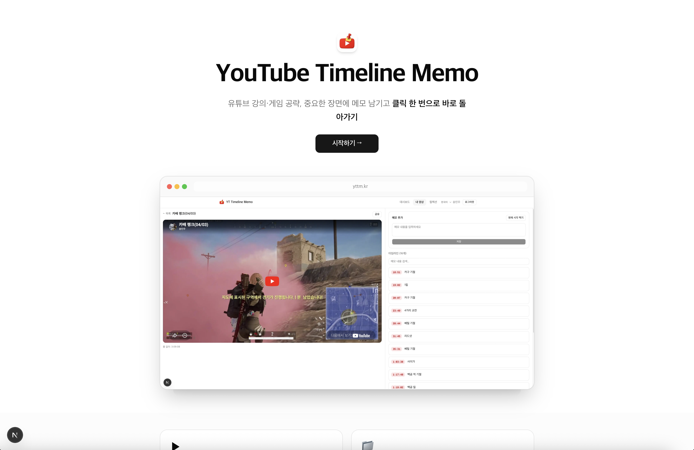
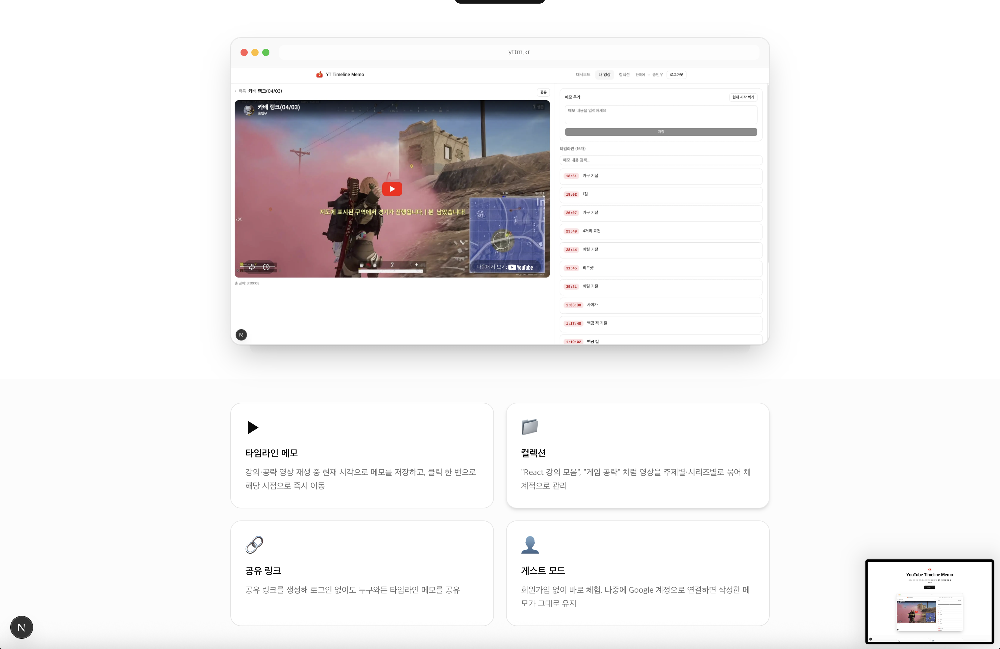

### 로그인 (`/login`)

Google 계정으로 로그인하거나, 로그인 없이 게스트로 바로 서비스를 체험할 수 있습니다. 게스트로 시작한 경우 상단 헤더에 "게스트" 배지가 표시되며, "Google로 계정 연결" 버튼으로 언제든지 계정을 업그레이드할 수 있습니다. 업그레이드 시 기존에 작성한 영상·메모·컬렉션 데이터가 그대로 유지됩니다.

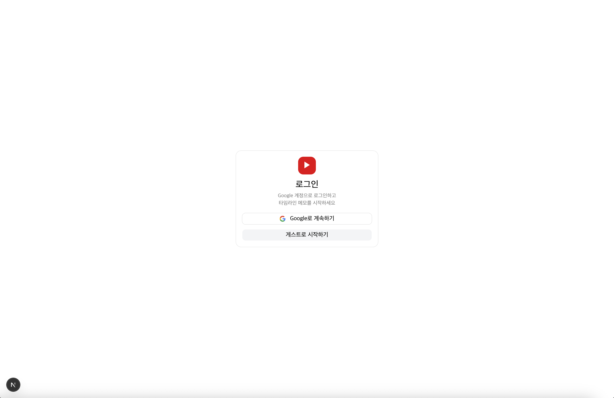

### 대시보드 (`/dashboard`)

로그인 후 첫 화면입니다. 최근 영상(최대 4개)과 컬렉션(최대 4개)을 한눈에 확인하고, 각 섹션에서 모두 보기로 전체 목록 페이지로 이동할 수 있습니다.

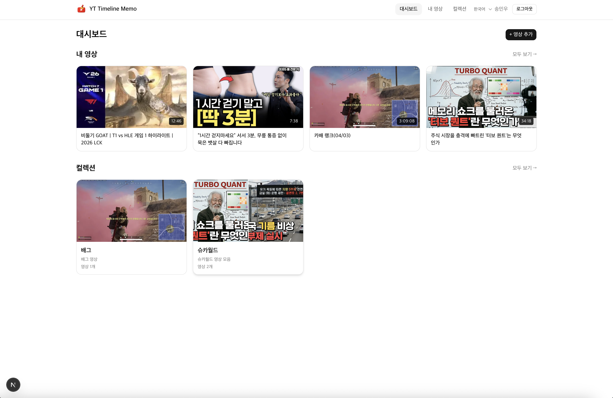

### 영상 목록 (`/videos`)

등록한 전체 영상을 카드 형태로 확인합니다. 제목 검색 필터로 원하는 영상을 빠르게 찾을 수 있습니다.

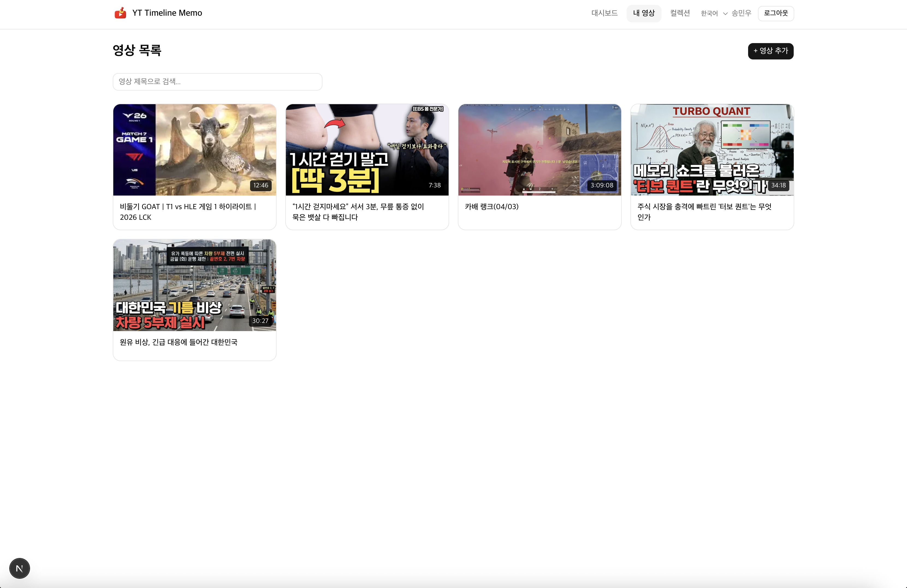

### 영상 추가

YouTube URL을 직접 입력하거나 키워드 검색으로 영상을 추가합니다. 제목·썸네일·재생 시간이 자동으로 파싱됩니다.

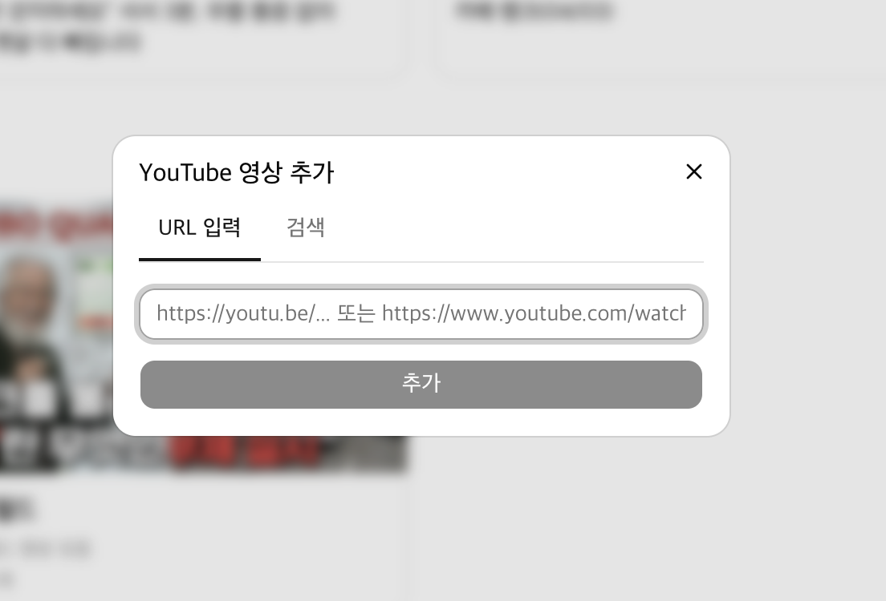
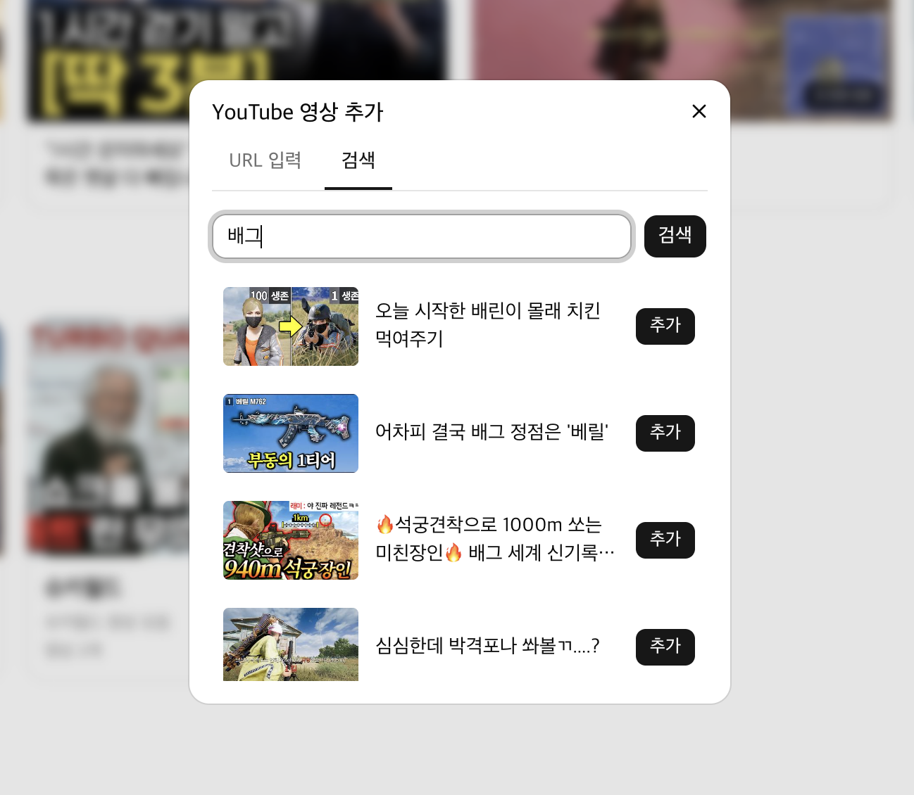

### 영상 뷰어 (`/videos/:id`)

서비스의 핵심 페이지입니다. 좌측 YouTube 플레이어와 우측 타임라인 메모 목록이 좌우 분할 구조로 배치됩니다. 메모 클릭 시 해당 시점으로 즉시 이동하며, 메모 더블클릭으로 인라인 수정이 가능합니다.

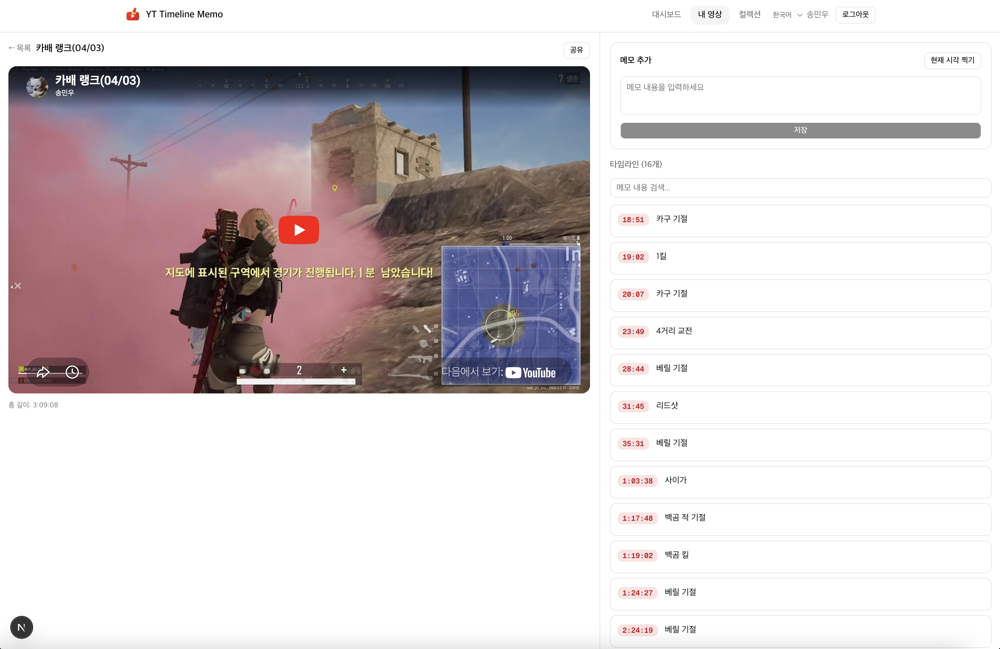

### 컬렉션 (`/collections`)

영상을 주제별 폴더로 묶어서 관리합니다. 컬렉션 카드를 클릭하면 포함된 영상 목록과 추가 가능한 영상을 관리할 수 있는 다이얼로그가 열립니다.

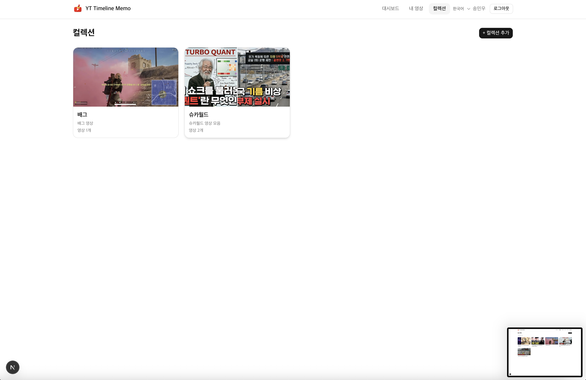
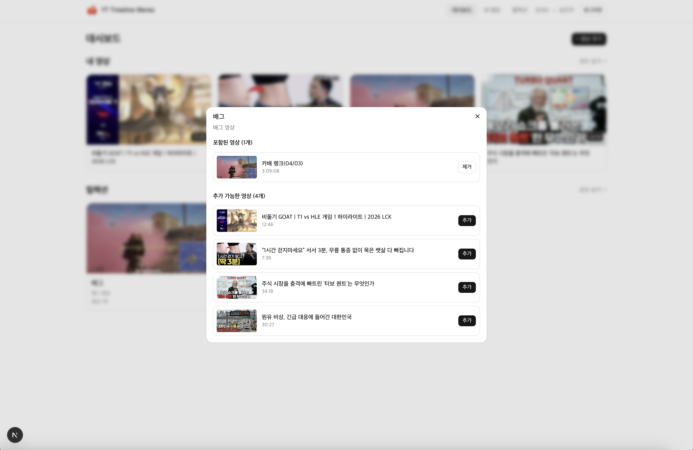

### 공유 링크

영상 뷰어에서 공유 버튼을 누르면 타임라인 메모가 담긴 공유 URL을 생성하고 복사할 수 있습니다. 링크를 받은 누구나 로그인 없이 타임라인 메모를 열람할 수 있습니다.

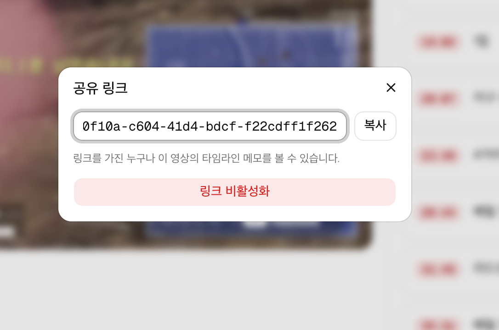

### 관리자 페이지 (`/admin`)

관리자 계정 전용 페이지입니다. 전체 사용자·영상·컬렉션 통계를 확인하고, 사용자별 등록 영상과 컬렉션 상세 현황을 펼쳐볼 수 있습니다.

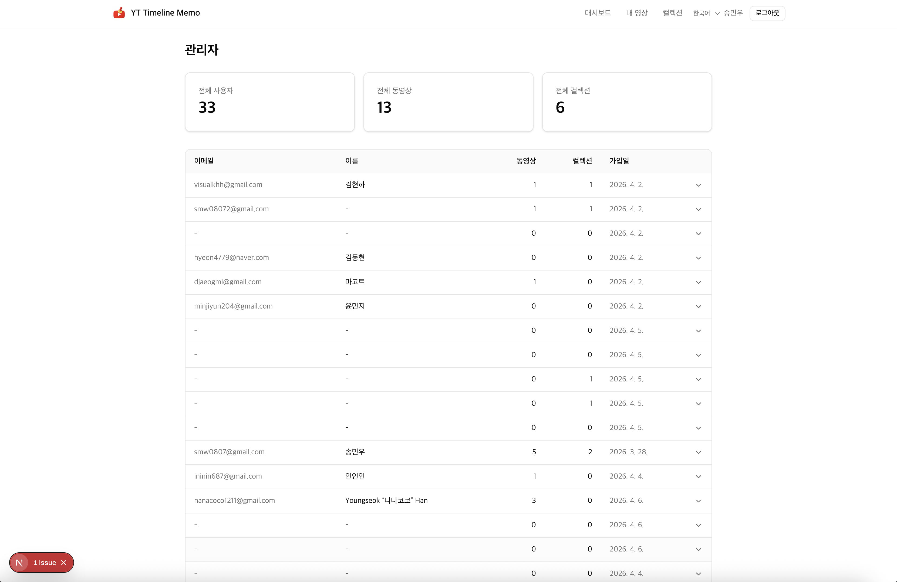
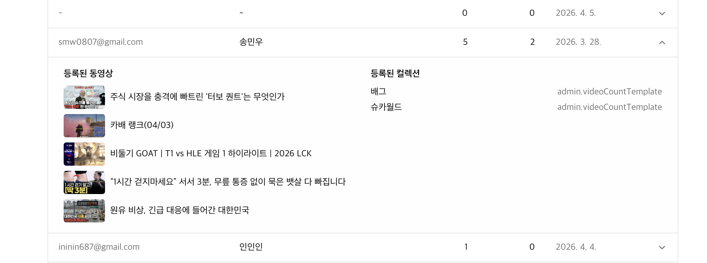

## 크롬 확장프로그램

YouTube Timeline Memo는 웹 서비스 외에도 **Chrome 확장프로그램**을 제공합니다. YouTube 페이지를 벗어나지 않고 바로 타임라인 메모를 작성하고 관리할 수 있습니다.

### 주요 기능

- **팝업 패널** — 확장 아이콘 클릭 시 최근 등록 영상 목록 확인 및 웹 서비스로 바로 이동
- **사이드 패널** — YouTube 영상 시청 중 현재 재생 시각 자동 기록 + 메모 저장 (페이지 이탈 없음)
- 웹 서비스와 동일한 Firebase 계정으로 로그인 — 데이터 완전 동기화

### 팝업 패널

확장 아이콘을 클릭하면 최근 등록한 영상 목록이 표시됩니다. 항목을 클릭하거나 하단 버튼으로 웹 서비스 전체 화면으로 이동할 수 있습니다.

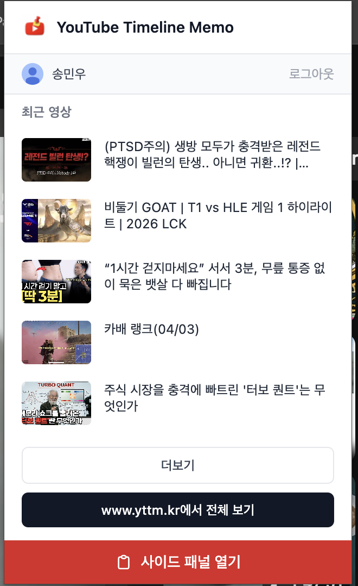

### 사이드 패널

YouTube 영상 페이지에서 "사이드 패널 열기" 버튼을 누르면 화면 옆에 타임라인 메모 패널이 펼쳐집니다. 현재 재생 시각을 자동으로 불러오고, 메모를 입력 후 저장하면 웹 서비스와 즉시 동기화됩니다.

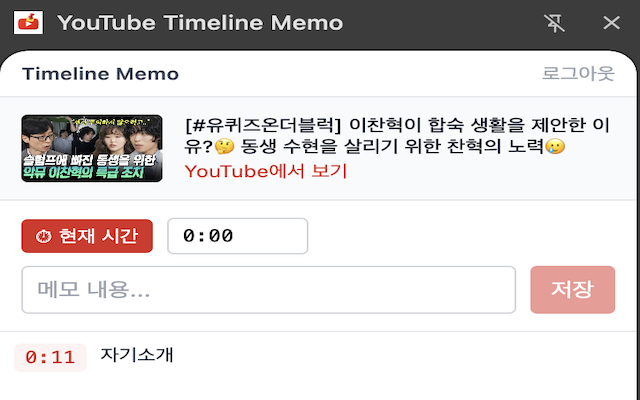
